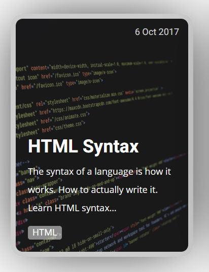
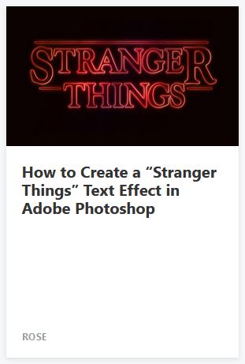
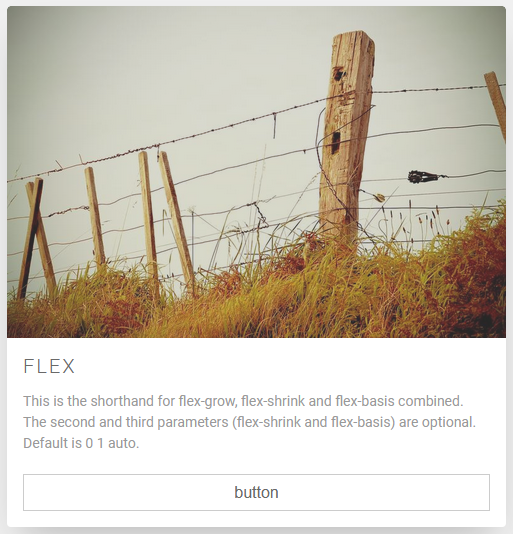

# BrowserAPI

## Exercise 1

Use `document.createElement()` and `element.appendChild()` to add elements on a web page.

## Exercise 2

Use `Element.remove()` and `Node.removeChild()` to remove elements from a web page.

## Exercise 3

Given the following html, create a eventlistener that changes the color on a element when clicked. The `rndColor()` function returns a random color.

HTML:

```HTML
<html>
  <head>
    <title>Color changer</title>
  </head>
  <body>
    <a href="#" class="clickme">The link</a>
    <script>
      const rndColor = () => {
        return `rgb(${50 + Math.random() * 206}, ${50 + Math.random() * 206}, ${50 + Math.random() * 206})`;
      };
    </script>
  </body>
</html>
```

> Hint: `element.addEventListener()`, `document.querySelector()`, `element.style.color`

## Exercise 4

Given the following HTML, when the user pushes the button the text in the input-field should be reversed.

```HTML
  <html>
    <!-- ... -->
    <form>
      <input type="text" class="thetext" value="I should be reversed" />
      <input type="button" class="thebutton" value="Reverse text" />
    </form>
    <!-- ... -->
  </html>
```

## Exercise 5

With the starting html code:

```html
<html>
  <head>
    <title>Document</title>
  </head>
  <body>
    <main class="main"></main>
  </body>
</html>
```

Use the DOM API to alter the document to the following (not using innerHTML)

```html
<html>
  <head>
    <title>Document</title>
  </head>
  <body>
    <main class="main">
      <nav>
        <a href="#">Link 1</a>
        <a href="#">Link 2</a>
        <a href="#">Link 3</a>
      </nav>
    </main>
  </body>
</html>
```

When you click on one of the links, the link should be deleted from the DOM.

> Hint: Look at `document.createElement(), element.appendChild(), element.remove()`

# Async

## Exercise 1

Create a function `getPastTime(callback)` that returns the time five (5) seconds ago without calculating the time with the Date object.

Example use:

```javascript
getPastTime(function (pastTime) {
  console.log(new Date().getSeconds(), pastTime); //-> 37, 32 || 3, 58
});
```

> Hint: the current time can be obtain with `const now = new Date()` and then `now.getSeconds()`

## Excercise 2

Create a function `concatStrings(string1, string2, callback)` that takes two strings and concats (add them together) them. Example: string1 = 'hello' string2 = 'world' -> helloworld.

- The function does not return anything (undefined), but instead takes a function **callback** which will be called with the result of the operation as first parameter.
- The function waits two seconds before calling back with the result.

Example use:

```javascript
concatStrings("hello", "world", function (joinedString) {
  console.log(joinedString); //-> helloworld
});
```

## Exercise 3

Create a function `promiseMeThis(string)` that returns a promise that resolves after 2 seconds with the text `I'll try to promise the following: <string>`.

Example use:

```javascript
promiseMeThis("To keep my promises").then((result) => {
  console.log(result); //-> I'll try to promise the following: To keep my promises
});
```

## Exercise 4

Create a async function `getWordPlays()` that returns a promise that resolves with one of the random phrases:

```javascript
const arr = [
  "Katten musen tio tusen",
  "Spaghetti makaroner, tio miljoner",
  "Blomma blad, en miljard",
  "Kalas kanon, en miljon",
  "Ettning Tvåning Trening Fyrning Femning Sexning Sjuning Åttning Nining Tidning",
];
```

Example use:

```javascript
getWordPlays().then((rhyme) => {
  console.log(rhyme); //-> Kalas kanon, en miljon
});
```

### Bonus:

Use a anyonymous self calling method and await the result instead of using .then()

# UX & Design

## Question 1

Think about the design process, what benefits do we get by working analog instead of digital.

## Question 2

What are the benefits with agile projects when developing software?

## Question 3

What roles exists in a scrum team?

## Question 4

Who decides what to work with during a sprint and adds it to the backlog?

## Question 5

What is the purpose of a daily scrum meeting, and what does it consist of?

# Layout and Styling

Using HTML and SCSS, recreate the following cards. Background images can be found in [backgrounds](./backgrounds)

You should use variables for things that make sense, like colors and font.

Card 1:

Use Arial, Helvetica as font.



Card 2:

Use Helvetica, Arial, sans-serif as font.



Card 3:

Use the Roboto font https://fonts.google.com/specimen/Roboto

```HTML
<link rel="preconnect" href="https://fonts.googleapis.com">
<link rel="preconnect" href="https://fonts.gstatic.com" crossorigin>
<link href="https://fonts.googleapis.com/css2?family=Roboto&display=swap" rel="stylesheet">
```


