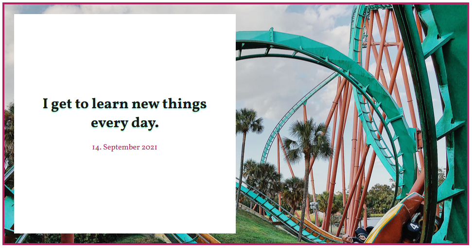
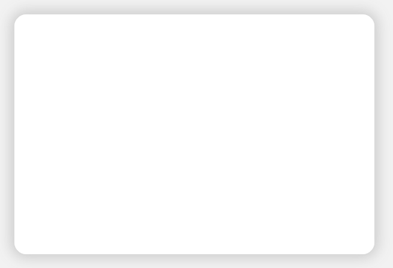

# SCSS Exercise

## Task 1

In the folder [./scss-exercise/](./scss-exercise/) there is a index.html and target.css
Create the same output with a scss file as there is in target.css (omit the comments)

## Task 2

Create a new scss file that you then transpile into a css file and try to mimic the
designs presented in the static folder.
Create one card for each example on the same page.

(Bonus: Animate as image below)

(Bonus: Animate as image below)

